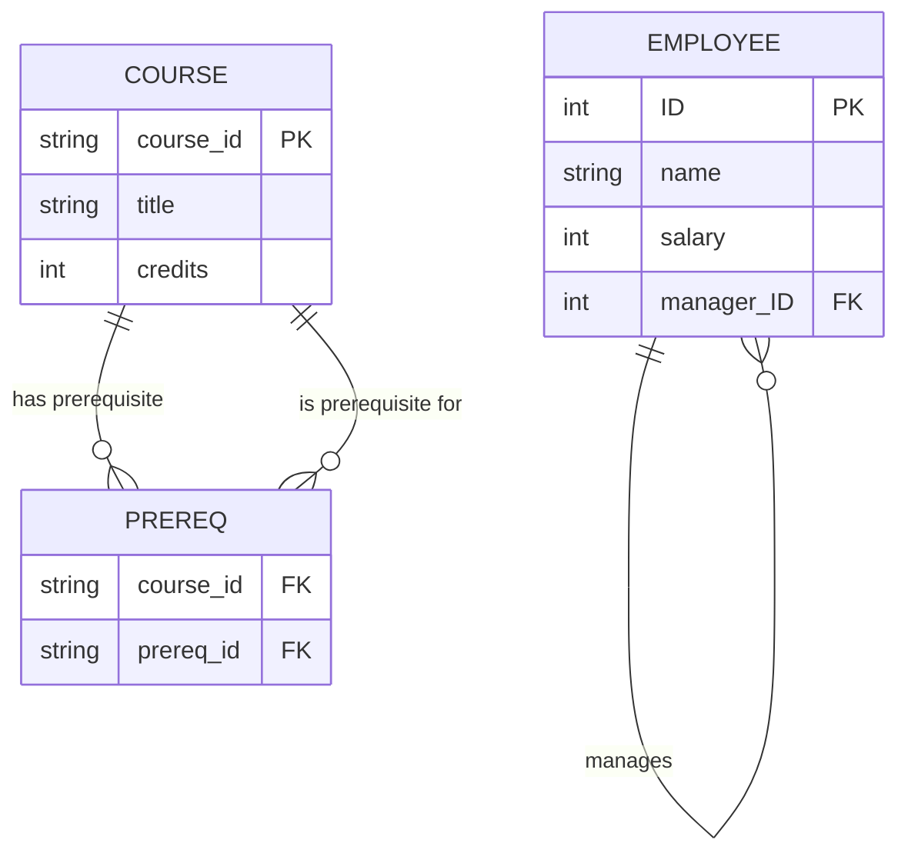
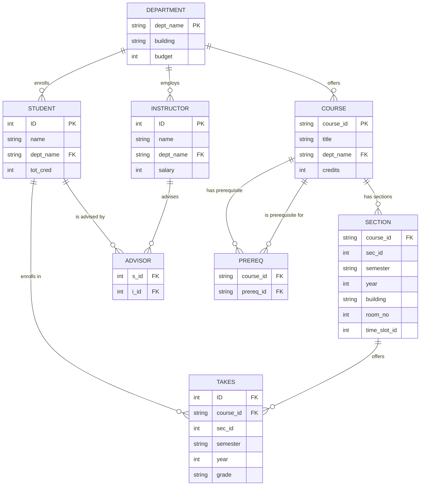
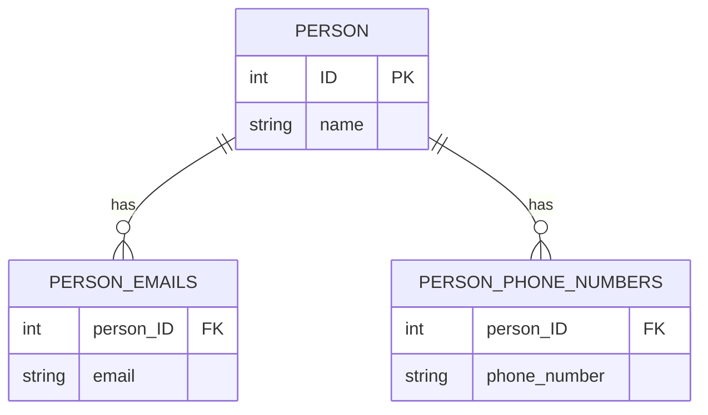
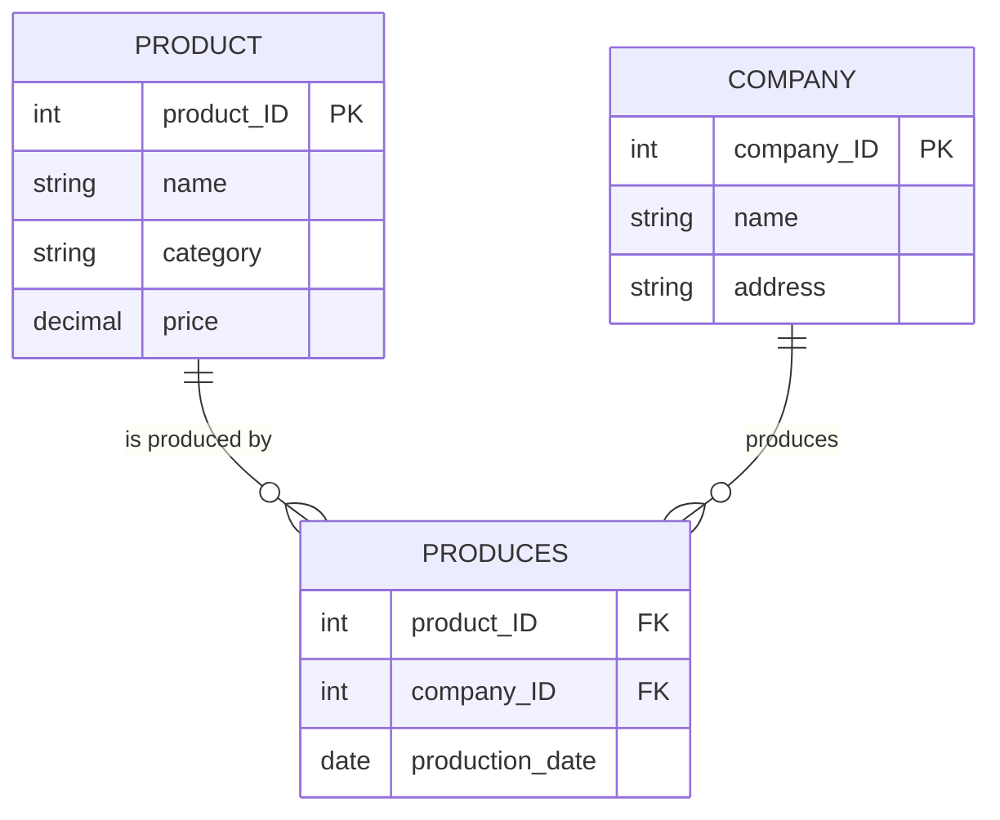
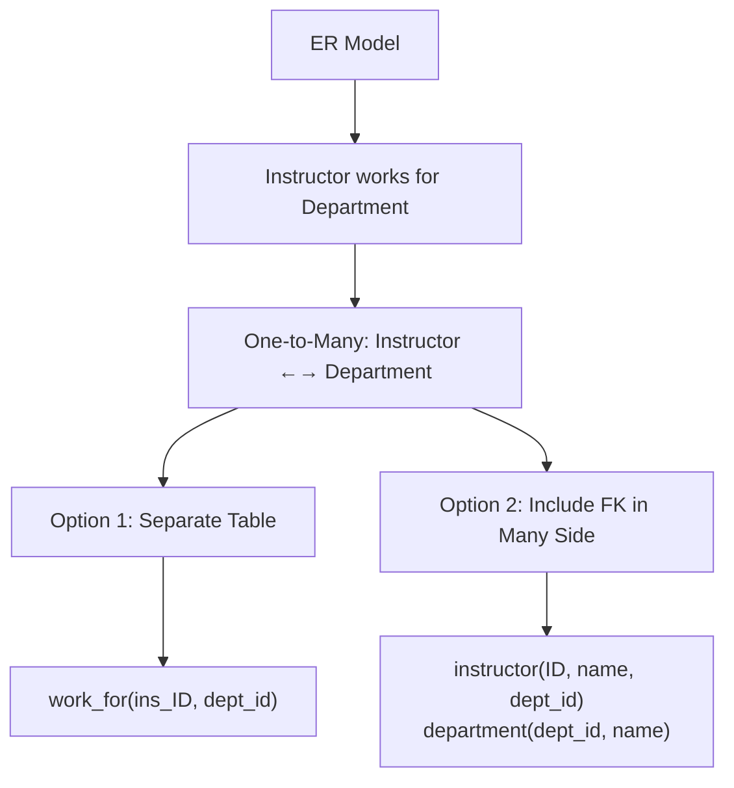
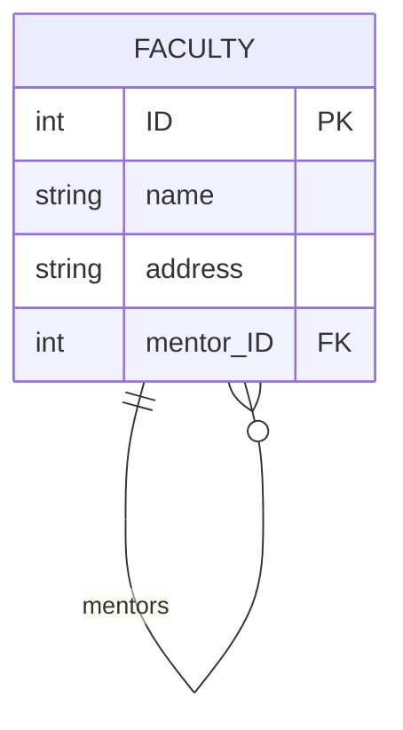
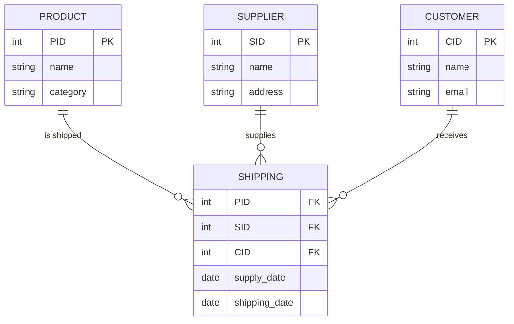
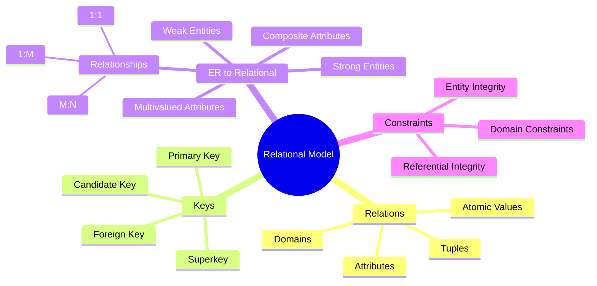

# Relational Model - Part 1: Complete Notes

## Overview
**Source**: Database System Concepts by Silberschatz, Korth, and Sudarshan  
**Topic Coverage**: Relational Model fundamentals and ER-to-Relational mapping

## Table of Contents
1. Relational Data Model Introduction
2. Relation Components
3. Keys and Constraints
4. Converting ER Diagrams to Relation Schemas
5. Schema Diagrams
6. Practical Examples and Poll Questions

## 1. Relational Data Model Introduction

### Historical Context
- **Developed in 1969** by Edgar Codd at IBM (before the ER model)
- Foundational model for modern database systems
- A relational database consists of a collection of **relations (tables)**

## 2. Relation Components

### Basic Structure
- **Relation**: A table with rows and columns
- **Relation Schema**: The structure description of a relation
  - Format: `R(A₁, A₂, ..., Aₙ)` where R is the relation name and Aᵢ are attributes
- **Relation Instance**: The current set of tuples (rows) in the relation
- **Tuple**: A single row in the relation
- **Attribute**: A column in the relation

### Formal Definition
- Given domains D₁, D₂, ..., Dₙ, a **relation r** is a subset of:
  ```
  D₁ × D₂ × ... × Dₙ
  ```
- A relation is a set of n-tuples (a₁, a₂, ..., aₙ) where each aᵢ ∈ Dᵢ

### Example Relation: instructor
**Schema**: `instructor(ID, name, dept_name, salary)`

| ID    | name      | dept_name | salary |
|-------|-----------|-----------|--------|
| 10101 | Srinivasan | Comp.Sci. | 65000  |
| 12121 | Wu        | Finance   | 90000  |
| 22222 | Einstein  | Physics   | 95000  |

### Important Properties
- **Tuples are unordered** - order of rows is irrelevant
- **Attribute values are atomic** - indivisible values
- **Null value** is a member of every domain
- **Domain**: Set of permitted values for each attribute

## 3. Keys and Constraints

### Key Types
- **Superkey**: A set of attributes whose values uniquely identify a tuple
  - Example: `{ID}` and `{ID, name}` are both superkeys of instructor
- **Candidate Key**: A minimal superkey (no proper subset is a superkey)
  - Example: `{ID}` is a candidate key for instructor
- **Primary Key**: The selected candidate key for identifying tuples

### Foreign Key Constraints
- **Foreign Key**: Value in one relation must appear in another relation
- **Referencing Relation**: Contains the foreign key
- **Referenced Relation**: Contains the corresponding primary key

**Example**:
```
Employee (employee_ID, dept_ID)          -- referencing
Department (dept_ID, dept_name)          -- referenced
```
The `dept_ID` in Employee must exist in Department's `dept_ID`

## 4. Converting ER Diagrams to Relation Schemas

### General Principles
- Each entity set and relationship set becomes a relation schema
- Schema names correspond to entity/relationship set names
- Primary key attributes are underlined
- Format: `R(A₁, A₂, ..., Aₙ)`

### Strong Entity Sets
- Create a schema with the same attributes
- **Example**: 
  - ER: `course(course_id, title, credits)`
  - Relation: `course(course_id, title, credits)`

### Weak Entity Sets
- Include primary key of identifying strong entity set plus discriminator
- **Example**:
  - ER: Weak entity `section` with identifying entity `course`
  - Relation: `section(course_id, sec_id, semester, year)`

### Composite Attributes
- Flatten by creating separate attributes for each component
- **Example**: Composite attribute `name(first_name, last_name)`
  - Becomes: `first_name, last_name` in the relation schema

### Multivalued Attributes
- Create separate schema: `E_M` where E is entity and M is multivalued attribute
- Schema includes primary key of E plus the multivalued attribute
- **Example**: Multivalued `phone_number` in `instructor`
  - Schema: `instructor_phone(ins_ID, phone_number)`
  - Each phone number becomes a separate tuple

### Relationship Set Conversions

#### Many-to-Many Relationships
- Create schema with primary keys of both participating entity sets
- **Example**: `advisor` relationship between `instructor` and `student`
  - Schema: `advisor(ins_ID, student_ID)`

#### One-to-One Relationships
Three alternatives:

1. **Create relationship schema**: `work_for(faculty_ID, department_ID)`
2. **Include in entity with total participation** (to avoid nulls):
   - `faculty(ID, name, salary, dept_ID)`
   - `department(ID, name)`
3. **Merge both entities** (if both have total participation):
   - `faculty_department(faculty_ID, name, salary, dept_ID, dept_name)`

#### One-to-Many / Many-to-One Relationships
Two alternatives:

1. **Create relationship schema**: `works(employee_ID, dept_ID)`
2. **Include foreign key in "many" side**:
   - `employee(ID, name, salary, dept_ID)`
   - `department(ID, name)`

### Relationship Sets with Attributes
- Include attributes in the relationship schema
- **Example**: `contract(author_ID, pub_ID, date)`

### Recursive Relationships (Role Indicators)
- Include foreign key referencing the same relation
- **Example**: `employee(ID, name, salary, manager_ID)`
- **Example**: `prereq(course_id, prereq_id)`



**Recursive Relationships:**
- **Self-Referencing**: Employee table references itself for manager relationships
- **Separate Table**: Prereq table for course prerequisites (many-to-many self-relationship)
- **Key Point**: Same entity participates in relationship with different roles

### Generalization/Specialization

#### Disjoint Specialization
- **Total**: Can create separate relations for subclasses
- **Partial**: Multiple representation approaches possible

**Example**:
```
Employee(eID, name)
Tester(eID, name, specialization)
SWE(eID, name, token)
```

### Aggregation
- Treat the relationship as an abstract entity
- **Example**: 
  - `treat(doctor_ID, patient_ID, date)`
  - `support_ER(doctor_ID, patient_ID, treat_date, staff_ID, date, #hours)`

## 5. Schema Diagrams

### Purpose
- Visual representation of relational database schema
- Shows relations, primary keys, and foreign key dependencies

### Components
- **Boxes** represent relations
- **Relation name** at top of box
- **Attributes** listed inside box
- **Primary key** underlined
- **Arrows** show foreign key dependencies

### University Database Example
```
takes(ID, course_id, sec_id, semester, year, grade)
student(ID, name, dept_name, tot_cred)
section(course_id, sec_id, semester, year, building, room_no, time_slot_id)
course(course_id, title, dept_name, credits)
department(dept_name, building, budget)
instructor(ID, name, dept_name, salary)
advisor(s_id, i_id)
prereq(course_id, prereq_id)
```



**Complete University Database Schema:**
- **Primary Keys**: Underlined attributes (ID, course_id, dept_name)
- **Foreign Keys**: Arrows show referential integrity constraints
- **Relationships**: Different cardinalities (1:1, 1:M, M:N) clearly shown

## 6. Practical Examples and Poll Questions

### Poll 1: Multivalued Attributes
**Question**: How many relation schemas for Person with multivalued emails and phone numbers?
**Answer**: 3 schemas
- `Person(ID, name)`
- `Person_emails(person_ID, email)`
- `Person_phone_numbers(person_ID, phone_number)`



**Multivalued Attributes Solution:**
- **Main Entity**: Person table with single-valued attributes
- **Separate Tables**: One for each multivalued attribute
- **Key Point**: Each multivalued attribute becomes its own table with foreign key

### Poll 2: Relationship Mapping
**Question**: How many schemas for Product-Companies relationship?
**Answer**: 3 schemas (one for each entity set plus one for the relationship)



**Many-to-Many Relationship Mapping:**
- **Entity Tables**: Product and Company (one each)
- **Relationship Table**: Produces (one for the many-to-many relationship)
- **Total**: 3 schemas as expected

### Poll 3: One-to-Many Relationship
**Question**: Correct schema for work_for relationship?
**Answer**: `work_for(ins_ID, dept_id)` or include `dept_id` in instructor schema



**One-to-Many Relationship Options:**
- **Option 1**: Separate relationship table (good for complex relationships)
- **Option 2**: Include foreign key in the "many" side (instructor table)
- **Recommendation**: Option 2 is more common and efficient for simple relationships

### Poll 4: Recursive Relationship
**Question**: Correct schema for faculty mentor relationship?
**Answer**: `faculty(ID, name, address, mentor_ID)` or separate relationship table



**Recursive Relationship Solution:**
- **Self-Referencing**: Faculty table references itself for mentor relationships
- **Foreign Key**: `mentor_ID` references `ID` in the same table
- **Key Point**: Same entity participates in relationship with different roles (mentor/mentee)

### Poll 5: Ternary Relationship with Attributes
**Question**: Correct schema for shipping relationship?
**Answer**: `shipping(PID, SID, supply_date, CID, shipping_date)`



**Ternary Relationship with Attributes:**
- **Three Entities**: Product, Supplier, Customer
- **Relationship Table**: Shipping with all foreign keys and relationship attributes
- **Key Point**: Ternary relationships require a separate table with all participating entity keys

## Key Takeaways

1. **Relational Model** provides mathematical foundation for database systems
2. **Relations** are unordered sets of tuples with atomic attributes
3. **Keys** ensure tuple identification and integrity
4. **ER-to-Relational mapping** follows systematic rules for different cases
5. **Schema diagrams** visualize database structure and relationships
6. **Multiple alternatives** exist for representing relationships, chosen based on constraints and query patterns



**Learning Path Summary:**
- **Foundation**: Understand relations, tuples, and attributes
- **Structure**: Learn about keys and constraints
- **Mapping**: Master ER-to-relational conversion rules
- **Practice**: Apply concepts through visual examples and poll questions

This comprehensive coverage ensures understanding of relational model fundamentals and the systematic process of converting ER designs to relational schemas.