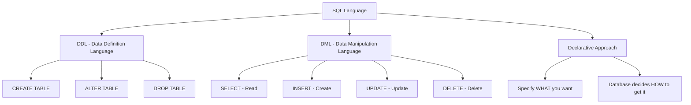
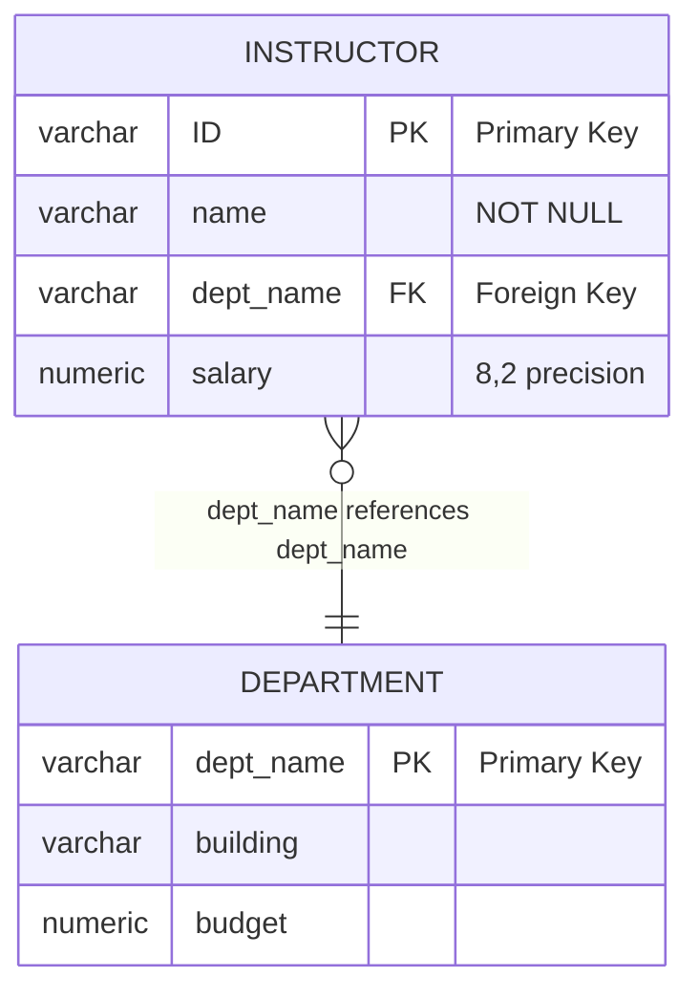
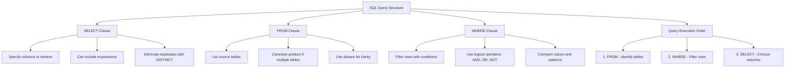
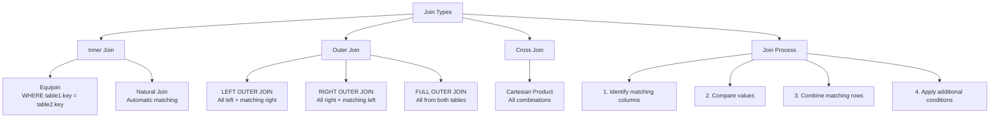
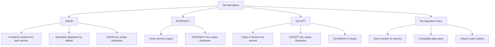
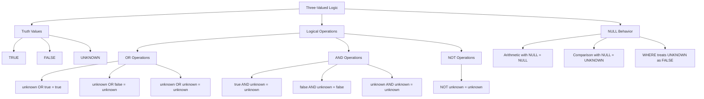
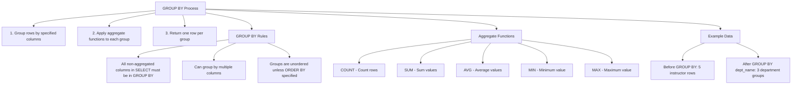
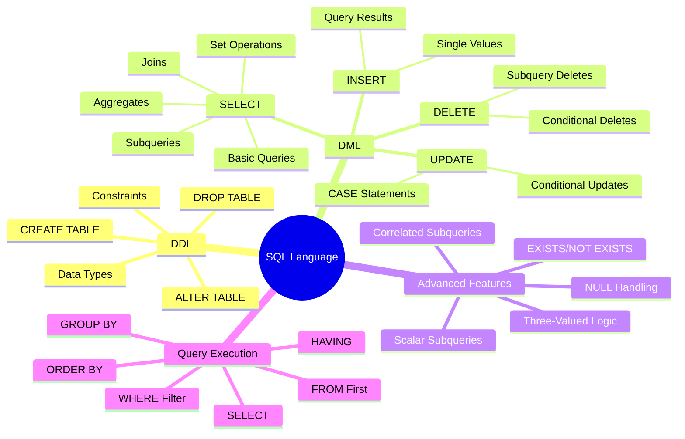

# SQL (Structured Query Language) - Part 2: Complete Notes

## Overview
**Source**: Database System Concepts by Silberschatz, Korth, and Sudarshan  
**Topic Coverage**: Comprehensive SQL language fundamentals and advanced features

## Table of Contents
1. SQL History and Overview
2. Data Definition Language (DDL)
3. Data Manipulation Language (DML)
4. Basic Query Structure
5. Advanced Query Operations
6. Set Operations
7. Null Values and Three-Valued Logic
8. Aggregate Functions
9. Nested Subqueries
10. Database Modification
11. Practical Examples and Poll Questions

## 1. SQL History and Overview

### Historical Development
- **IBM Sequel** language developed as part of System R project at IBM San Jose Research Laboratory
- Renamed to **Structured Query Language (SQL)**
- **ANSI and ISO Standards**:
  - SQL-86, SQL-89, SQL-92
  - SQL:1999, SQL:2003, SQL:2008
- Commercial systems offer most SQL-92 features plus proprietary extensions

### SQL Characteristics
- **Declarative Programming Language**: Specify what data you want, not how to get it
- **Two Main Components**:
  - **DDL (Data Definition Language)**: Create, alter, remove tables
  - **DML (Data Manipulation Language)**: CRUD operations (Create, Read, Update, Delete)



**SQL Language Structure:**
- **DDL**: Defines database structure and schema
- **DML**: Manipulates data within the database
- **Declarative**: Focus on the result, not the process

## 2. Data Definition Language (DDL)

### Purpose
DDL allows specification of:
- Schema for each relation
- Domain of values for each attribute
- Integrity constraints
- Indices for each relation
- Security and authorization information
- Physical storage structure

### Domain Types in SQL
- **char(n)**: Fixed length character string
- **varchar(n)**: Variable length character string
- **int**: Integer (machine-dependent)
- **smallint**: Small integer
- **numeric(p,d)**: Fixed point number with precision
- **real, double precision**: Floating point numbers
- **float(n)**: Floating point with specified precision

```mermaid
graph LR
    A[SQL Data Types] --> B[Character Types]
    A --> C[Numeric Types]
    A --> D[Date/Time Types]
    
    B --> E[char(n)<br/>Fixed length]
    B --> F[varchar(n)<br/>Variable length]
    
    C --> G[int<br/>Integer]
    C --> H[smallint<br/>Small integer]
    C --> I[numeric(p,d)<br/>Fixed point]
    C --> J[real/double precision<br/>Floating point]
    C --> K[float(n)<br/>Floating with precision]
    
    D --> L[date<br/>Date only]
    D --> M[time<br/>Time only]
    D --> N[timestamp<br/>Date and time]
```

**Data Type Categories:**
- **Character**: Text data with fixed or variable length
- **Numeric**: Integer and decimal numbers
- **Date/Time**: Temporal data types

### Create Table Construct
```sql
create table r (
    A₁ D₁,
    A₂ D₂,
    ...,
    Aₙ Dₙ,
    (integrity-constraint₁),
    ...,
    (integrity-constraintₖ)
)
```

### Integrity Constraints
- **not null**: Attribute cannot be null
- **primary key (A₁, ..., Aₙ)**: Defines primary key
- **foreign key (Aₘ, ..., Aₙ) references r**: Defines foreign key

**Example**:
```sql
create table instructor (
    ID varchar(5),
    name varchar(20) not null,
    dept_name varchar(20),
    salary numeric(8,2),
    primary key (ID),
    foreign key (dept_name) references department
)
```



**Table Creation Example:**
- **Primary Key**: ID (automatically NOT NULL and UNIQUE)
- **Foreign Key**: dept_name references department table
- **Constraints**: NOT NULL on name, referential integrity on dept_name

### Table Modification
- **drop table student**: Deletes table and contents
- **delete from student**: Deletes contents but retains table (DML)
- **alter table r add A D**: Adds new attribute
- **alter table r drop A**: Drops attribute (not widely supported)

## 3. Data Manipulation Language (DML)

### Basic Query Structure
```sql
select A₁, A₂, ..., Aₙ
from r₁, r₂, ..., rₘ
where P
```
- **Aᵢ**: Attributes
- **Rᵢ**: Relations
- **P**: Predicate
- **Result**: Always a relation



**Query Structure Components:**
- **SELECT**: What columns to return
- **FROM**: Which tables to query
- **WHERE**: What conditions to apply
- **Execution Order**: FROM → WHERE → SELECT

## 4. Basic Query Structure Components

### SELECT Clause
- Lists desired attributes in result
- **Case insensitive**: Name = NAME = name
- **Duplicates**: Allowed by default
- **distinct**: Eliminates duplicates
- **all**: Explicitly keeps duplicates (default)
- *****: Selects all attributes
- **Arithmetic expressions**: Can use +, -, *, /

**Examples**:
```sql
select name from instructor
select distinct dept_name from instructor
select ID, name, salary/12 from instructor
```

### WHERE Clause
- Specifies conditions result must satisfy
- Corresponds to relational algebra selection
- Uses logical connectives: and, or, not

**Example**:
```sql
select name
from instructor
where dept_name = 'Comp. Sci.' and salary > 80000
```

### FROM Clause
- Lists relations involved in query
- **Cartesian product**: Generated when multiple relations listed
- Combined with WHERE clause for useful results

**Example**:
```sql
select * from instructor, teaches
```

### Joins
- Combine data from multiple relations
- **Equijoin**: Matching tuples based on equality

**Examples**:
```sql
-- Natural join
select name, course_id
from instructor, teaches
where instructor.ID = teaches.ID

-- Multi-table join with conditions
select section.course_id, semester, year, title
from section, course
where section.course_id = course.course_id 
  and dept_name = 'Comp. Sci.'
```



**Join Visualization:**
- **Inner Join**: Only matching rows from both tables
- **Outer Join**: All rows from one table + matching rows from other
- **Cross Join**: All possible combinations (Cartesian product)

### Rename Operation (AS Clause)
- Renames relations and attributes
- **as** keyword optional (required to be omitted in Oracle)

**Examples**:
```sql
select ID, name, salary/12 as monthly_salary
from instructor

-- Self-join with correlation variables
select distinct T.name
from instructor as T, instructor as S
where T.salary > S.salary and S.dept_name = 'Comp. Sci.'
```

### ORDER BY Clause
- Controls display order of tuples
- **asc**: Ascending order (default)
- **desc**: Descending order
- Multiple attributes supported

**Example**:
```sql
select distinct name
from instructor
order by name desc
```

### BETWEEN Operator
- Range comparison
- Inclusive of endpoints

**Example**:
```sql
select name
from instructor
where salary between 90000 and 100000
```

## 5. Advanced Query Operations

### String Operations
- Pattern matching with **like**
- **%**: Matches any substring
- **_**: Matches any single character

### Tuple Comparison
- Compare multiple attributes simultaneously

**Example**:
```sql
select name, course_id
from instructor, teaches
where (instructor.ID, dept_name) = (teaches.ID, 'Biology')
```

## 6. Set Operations

### Basic Set Operations
- **union**: Combines results, eliminates duplicates
- **intersect**: Finds common tuples
- **except**: Finds tuples in first but not second
- **union all**, **intersect all**, **except all**: Keep duplicates



**Set Operation Visualization:**
- **UNION**: All unique values from both sets
- **INTERSECT**: Only values present in both sets
- **EXCEPT**: Values in first set but not in second set

**Examples**:
```sql
-- Courses in Fall 2009 OR Spring 2010
select course_id from section 
where semester = 'Fall' and year = 2009
union
select course_id from section 
where semester = 'Spring' and year = 2010

-- Courses in Fall 2009 AND Spring 2010
select course_id from section 
where semester = 'Fall' and year = 2009
intersect
select course_id from section 
where semester = 'Spring' and year = 2010

-- Courses in Fall 2009 BUT NOT Spring 2010
select course_id from section 
where semester = 'Fall' and year = 2009
except
select course_id from section 
where semester = 'Spring' and year = 2010
```

**Note**: Use **minus** instead of **except** in Oracle

## 7. Null Values and Three-Valued Logic

### Null Value Properties
- Signifies unknown value or non-existent value
- **Arithmetic with null**: Any operation returns null
  - Example: `5 + null` returns null
- **Comparison with null**: Returns unknown

### Three-Valued Logic
- **Truth values**: true, false, unknown
- **OR**:
  - (unknown or true) = true
  - (unknown or false) = unknown
  - (unknown or unknown) = unknown
- **AND**:
  - (true and unknown) = unknown
  - (false and unknown) = false
  - (unknown and unknown) = unknown
- **NOT**: (not unknown) = unknown



**Three-Valued Logic Truth Tables:**
- **OR**: True dominates, unknown when both unknown
- **AND**: False dominates, unknown when one unknown
- **NOT**: Unknown remains unknown

### Testing for Null
- **is null**: Checks for null values
- **is not null**: Checks for non-null values

**Example**:
```sql
select name
from instructor
where salary is null
```

### WHERE Clause Behavior
- Predicate treated as **false** if it evaluates to unknown

## 8. Aggregate Functions

### Available Functions
- **avg**: Average value
- **min**: Minimum value
- **max**: Maximum value
- **sum**: Sum of values
- **count**: Number of values

### Basic Examples
```sql
-- Average salary in Computer Science
select avg(salary)
from instructor
where dept_name = 'Comp. Sci.'

-- Count instructors teaching in Spring 2010
select count(distinct ID)
from teaches
where semester = 'Spring' and year = 2010

-- Count all courses
select count(*) from course
```

### GROUP BY Clause
- Groups tuples by specified attributes
- Non-aggregated attributes in SELECT must be in GROUP BY

**Example**:
```sql
select dept_name, avg(salary)
from instructor
group by dept_name
```



**GROUP BY Visualization:**
- **Groups**: Rows with same values in GROUP BY columns
- **Aggregates**: Applied to each group separately
- **Result**: One row per unique group

### HAVING Clause
- Applies conditions to groups (after group formation)
- WHERE clause applies before group formation

**Example**:
```sql
select dept_name, avg(salary)
from instructor
group by dept_name
having avg(salary) > 42000
```

```mermaid
graph TD
    A[Query Execution Order] --> B[1. FROM - Get tables]
    A --> C[2. WHERE - Filter rows]
    A --> D[3. GROUP BY - Group rows]
    A --> E[4. HAVING - Filter groups]
    A --> F[5. SELECT - Choose columns]
    A --> G[6. ORDER BY - Sort results]
    
    H[WHERE vs HAVING] --> I[WHERE: Row-level filtering]
    H --> J[HAVING: Group-level filtering]
    
    I --> K[Applied before grouping]
    I --> L[Can use any column]
    I --> M[Cannot use aggregate functions]
    
    J --> N[Applied after grouping]
    J --> O[Can use GROUP BY columns]
    J --> P[Can use aggregate functions]
    
    Q[Example Flow] --> R[1. Get all instructor rows]
    Q --> S[2. WHERE filters individual rows]
    Q --> T[3. GROUP BY creates department groups]
    Q --> U[4. HAVING filters groups with avg(salary) > 42000]
    Q --> V[5. SELECT shows dept_name and avg(salary)]
    
    A --> H
    A --> Q
```

**WHERE vs HAVING:**
- **WHERE**: Filters individual rows before grouping
- **HAVING**: Filters groups after grouping
- **Key Point**: HAVING can use aggregate functions, WHERE cannot

### Null Values and Aggregates
- All aggregates except **count(*)** ignore null values
- **count** returns 0 if only null values
- Other aggregates return null if only null values

## 9. Nested Subqueries

### Subquery Concepts
- **Subquery**: SELECT-FROM-WHERE expression nested within another query
- Used for set membership, comparisons, and cardinality tests

```mermaid
graph TD
    A[Subquery Types] --> B[Scalar Subquery]
    A --> C[Set Membership]
    A --> D[Set Comparison]
    A --> E[Existence Test]
    
    B --> F[Returns single value]
    B --> G[Used in SELECT, WHERE, HAVING]
    B --> H[Error if returns multiple rows]
    
    C --> I[IN / NOT IN]
    C --> J[Checks if value exists in subquery result]
    C --> K[Handles NULL values carefully]
    
    D --> L[SOME / ALL]
    D --> M[Compares with some/all subquery values]
    D --> N[Useful for ranking queries]
    
    E --> O[EXISTS / NOT EXISTS]
    E --> P[Checks if subquery returns any rows]
    E --> Q[Returns TRUE/FALSE]
    
    R[Subquery Execution] --> S[Inner query executes first]
    R --> T[Result used in outer query]
    R --> U[Can be correlated or uncorrelated]
    
    A --> R
```



**Subquery Classification:**
- **Scalar**: Returns single value (used in expressions)
- **Set Membership**: Checks if value exists in set
- **Set Comparison**: Compares with some/all values
- **Existence**: Tests if subquery returns any rows

### Set Membership (IN, NOT IN)
**Examples**:
```sql
-- Courses in Fall 2009 AND Spring 2010
select distinct course_id
from section
where semester = 'Fall' and year = 2009
  and course_id in (
    select course_id
    from section
    where semester = 'Spring' and year = 2010
  )

-- Courses in Fall 2009 BUT NOT Spring 2010
select distinct course_id
from section
where semester = 'Fall' and year = 2009
  and course_id not in (
    select course_id
    from section
    where semester = 'Spring' and year = 2010
  )
```

### Set Comparison (SOME, ALL)
- **> some**: Greater than at least one
- **> all**: Greater than all

**Examples**:
```sql
-- Salary greater than some Biology instructor
select name
from instructor
where salary > some (
  select salary
  from instructor
  where dept_name = 'Biology'
)

-- Salary greater than all Biology instructors
select name
from instructor
where salary > all (
  select salary
  from instructor
  where dept_name = 'Biology'
)
```

### Test for Empty Relations (EXISTS, NOT EXISTS)
- **exists**: Returns true if subquery non-empty
- **not exists**: Returns true if subquery empty

```mermaid
graph TD
    A[EXISTS vs NOT EXISTS] --> B[EXISTS]
    A --> C[NOT EXISTS]
    
    B --> D[Returns TRUE if subquery has rows]
    B --> E[Returns FALSE if subquery is empty]
    B --> F[Ignores actual column values]
    B --> G[SELECT * is common practice]
    
    C --> H[Returns TRUE if subquery is empty]
    C --> I[Returns FALSE if subquery has rows]
    C --> J[Useful for "all" type queries]
    
    K[Correlated Subqueries] --> L[Reference outer query columns]
    K --> M[Execute once per outer row]
    K --> N[Enable complex filtering]
    
    O[Common Patterns] --> P[EXISTS: At least one match]
    O --> Q[NOT EXISTS: No matches]
    O --> R[NOT EXISTS with EXCEPT: All items]
    
    A --> K
    A --> O
```

**EXISTS vs NOT EXISTS:**
- **EXISTS**: True if subquery returns any rows
- **NOT EXISTS**: True if subquery returns no rows
- **Key Point**: EXISTS only cares about row existence, not values

**Examples**:
```sql
-- Courses in both Fall 2009 and Spring 2010
select course_id
from section as S
where semester = 'Fall' and year = 2009
  and exists (
    select *
    from section as T
    where semester = 'Spring' and year = 2010
      and S.course_id = T.course_id
  )

-- Students who took ALL Biology courses
select distinct S.ID, S.name
from student as S
where not exists (
  (select course_id
   from course
   where dept_name = 'Biology')
  except
  (select T.course_id
   from takes as T
   where S.ID = T.ID)
)
```

### Correlation Variables
- Subqueries can reference attributes from outer query
- Enables complex correlated subqueries

### Subqueries in FROM Clause
- Use subquery results as relations

**Example**:
```sql
select dept_name, avg_salary
from (
  select dept_name, avg(salary) as avg_salary
  from instructor
  group by dept_name
)
where avg_salary > 42000
```

### Scalar Subqueries
- Return single value
- Used where single value expected
- Runtime error if returns multiple tuples

**Examples**:
```sql
-- Department with instructor count
select dept_name,
  (select count(*)
   from instructor
   where department.dept_name = instructor.dept_name)
   as num_instructors
from department

-- Instructors with salary > 10% of department budget
select name
from instructor
where salary * 10 > (
  select budget
  from department
  where department.dept_name = instructor.dept_name
)
```

## 10. Database Modification

### Deletion
**Examples**:
```sql
-- Delete all instructors
delete from instructor

-- Delete Finance department instructors
delete from instructor
where dept_name = 'Finance'

-- Delete instructors in Watson building
delete from instructor
where dept_name in (
  select dept_name
  from department
  where building = 'Watson'
)

-- Delete instructors with below-average salary (with CTE)
with avg_salary as (
  select avg(salary) as avg_sal from instructor
)
delete from instructor
where salary < (select avg_sal from avg_salary)
```



```mermaid
graph TD
    A[Database Modification] --> B[DELETE]
    A --> C[INSERT]
    A --> D[UPDATE]
    
    B --> E[DELETE FROM table]
    B --> F[DELETE FROM table WHERE condition]
    B --> G[Can use subqueries in WHERE]
    B --> H[Returns number of affected rows]
    
    C --> I[INSERT INTO table VALUES]
    C --> J[INSERT INTO table SELECT]
    C --> K[Can specify column list]
    C --> L[Handles NULL values]
    
    D --> M[UPDATE table SET column = value]
    D --> N[UPDATE table SET column = value WHERE condition]
    D --> O[Can update multiple columns]
    D --> P[Can use CASE statements]
    
    Q[Modification Rules] --> R[Check constraints after modification]
    Q --> S[Maintain referential integrity]
    Q --> T[Use transactions for safety]
    Q --> U[Test with SELECT first]
    
    A --> Q
```

**Database Modification Operations:**
- **DELETE**: Remove rows (with optional conditions)
- **INSERT**: Add new rows (single or from query)
- **UPDATE**: Modify existing rows (with conditions)

### Insertion
**Examples**:
```sql
-- Insert single tuple
insert into course
values ('CS-437', 'Database Systems', 'Comp. Sci.', 4)

-- Explicit attribute list
insert into course (course_id, title, dept_name, credits)
values ('CS-437', 'Database Systems', 'Comp. Sci.', 4)

-- Insert with null values
insert into student
values ('3003', 'Green', 'Finance', null)

-- Insert from query result
insert into student
select ID, name, dept_name, 0
from instructor
```

### Updates
**Examples**:
```sql
-- Conditional update (problematic order)
update instructor
set salary = salary * 1.03
where salary > 100000

update instructor
set salary = salary * 1.05
where salary <= 100000

-- Better: Using CASE statement
update instructor
set salary = case
  when salary <= 100000 then salary * 1.05
  else salary * 1.03
end
```

## 11. Practical Examples and Poll Questions

### Poll Questions Summary

<details>
<summary>Click to reveal all poll answers</summary>

**Poll 6**: SELECT * FROM department returns 3 attributes  
**Answer**: True - SELECT * returns all columns (dept_name, building, budget)

**Poll 7**: SELECT dept_name, building FROM department returns 2 attributes  
**Answer**: True - Explicitly selecting 2 columns returns 2 attributes

**Poll 8**: Join query with 3 instructor tuples and 3 teaches tuples returns 3 rows  
**Answer**: False - Cartesian product would return 3×3=9 rows, but with proper join conditions it depends on matching

**Poll 9**: Query results allow duplicate tuples (True)  
**Answer**: True - SQL allows duplicates by default unless DISTINCT is used

**Poll 10**: Non-aggregated column not in GROUP BY causes error  
**Answer**: True - All non-aggregated columns in SELECT must be in GROUP BY

**Poll 11**: EXISTS returns only customers with at least one order  
**Answer**: True - EXISTS returns TRUE if subquery has any rows

**Poll 12**: Customers with more than 1 order returns 2 rows  
**Answer**: Depends on data - need to count actual customers with >1 order

**Poll 13**: GROUP BY product_id returns 4 rows  
**Answer**: Depends on data - returns one row per unique product_id

**Poll 14**: Scalar subquery with customer orders returns 3 rows  
**Answer**: False - Scalar subquery must return exactly one value

**Poll 15**: Complex customer query returns 1 column  
**Answer**: Depends on SELECT clause - could be 1 or more columns

</details>

### Practice Examples
The slides include multiple practice scenarios with customer and order tables demonstrating:
- Subqueries with COUNT and EXISTS
- GROUP BY with HAVING
- Scalar subqueries
- Complex nested queries

## Key Takeaways

1. **SQL is declarative**: Specify what you want, not how to get it
2. **Two main components**: DDL for structure, DML for data
3. **Query structure**: SELECT-FROM-WHERE forms the foundation
4. **Joins combine data**: From multiple relations using conditions
5. **Set operations**: UNION, INTERSECT, EXCEPT for combining results
6. **Three-valued logic**: True, false, unknown with null values
7. **Aggregates summarize data**: With GROUP BY and HAVING
8. **Subqueries enable complexity**: For set operations and correlations
9. **Database modification**: INSERT, UPDATE, DELETE with query support
10. **Order matters**: Especially in updates and complex queries



**SQL Learning Path:**
- **Foundation**: DDL for structure, DML for data manipulation
- **Queries**: SELECT-FROM-WHERE with joins and conditions
- **Advanced**: Aggregates, subqueries, and complex operations
- **Modification**: INSERT, UPDATE, DELETE with proper constraints

This comprehensive coverage ensures understanding of SQL from basic queries to advanced features like nested subqueries and complex modifications.