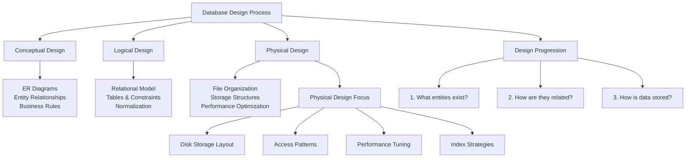
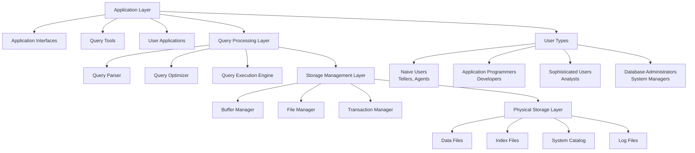
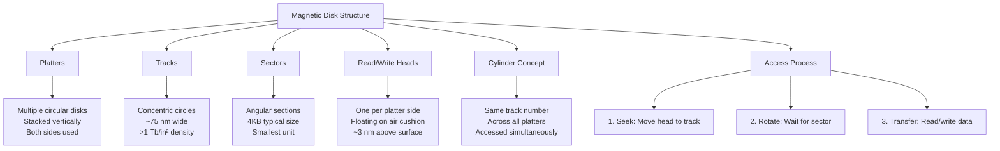
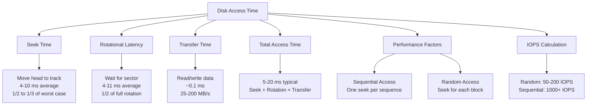
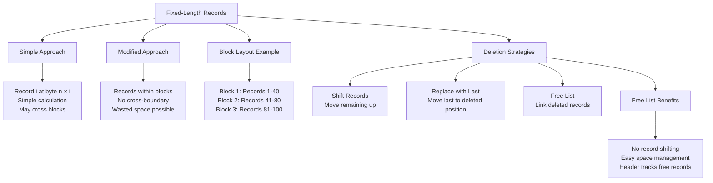
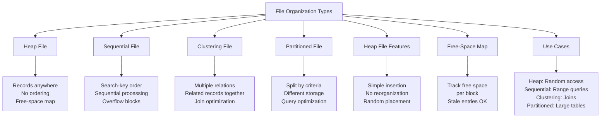

# File Organization - Part 1: Complete Notes

## Overview
**Source**: Database System Concepts, 7th Ed. by Silberschatz, Korth, and Sudarshan  
**Topic Coverage**: Physical database design, storage hierarchy, disk mechanics, and file organization

## Table of Contents
1. Database Design Process Overview
2. Database System Architecture
3. Storage Hierarchy
4. Magnetic Disk Mechanics
5. File Organization Fundamentals
6. Record Storage Methods
7. File Organization Types
8. Data Dictionary Storage
9. Practical Examples

## 1. Database Design Process Overview

### Three-Level Design Process
1. **Conceptual Design**: Entity-Relationship (ER) Diagram
2. **Logical Design**: Relational Model
3. **Physical Design**: File Organization and Storage

**Current Focus**: Physical Design - How data is actually stored and accessed on disk



**Database Design Hierarchy:**
- **Conceptual**: Business requirements and entity relationships
- **Logical**: Data model and table structures
- **Physical**: Storage implementation and performance optimization

## 2. Database System Architecture

### System Components and Users

#### User Types:
- **Naive users**: Tellers, agents, web users
- **Application programmers**: Write applications
- **Sophisticated users**: Analysts
- **Database administrators**: Manage the system

#### System Layers:
```
Application Interfaces
    ↓
Application Programs & Query Tools
    ↓
DML Queries & Object Code
    ↓
Query Evaluation Engine
    ↓
Buffer Manager & File Manager
    ↓
Disk Storage (Data, Indices, Dictionary)
```



**Database System Architecture:**
- **Layered Design**: Clear separation of concerns
- **User Interface**: Multiple user types with different access patterns
- **Query Processing**: Parsing, optimization, and execution
- **Storage Management**: Memory and disk management
- **Physical Storage**: Actual data persistence

### Key Components:
- **Query Processor**: Compiles and optimizes queries
- **Storage Manager**: Manages disk storage and memory
- **Buffer Manager**: Handles data transfer between disk and RAM
- **Transaction Manager**: Ensures ACID properties

## 3. Storage Hierarchy

### Storage Types:

#### Primary Storage (Volatile):
- **Cache**: Fastest, smallest
- **Main Memory (RAM)**: Fast, volatile

#### Secondary Storage (Non-Volatile):
- **Flash Memory**: SSDs, fast non-volatile
- **Magnetic Disk**: Traditional hard drives

#### Tertiary Storage (Archive):
- **Optical Disk**: CDs, DVDs
- **Magnetic Tapes**: Backup, archival

**Key Point**: Trade-off between speed, cost, and volatility across hierarchy levels

```mermaid
graph TD
    A[Storage Hierarchy] --> B[Primary Storage]
    A --> C[Secondary Storage]
    A --> D[Tertiary Storage]
    
    B --> E[Cache<br/>~1-10 MB<br/>~1-10 ns<br/>Volatile]
    B --> F[Main Memory (RAM)<br/>~1-100 GB<br/>~10-100 ns<br/>Volatile]
    
    C --> G[Flash Memory (SSD)<br/>~100 GB - 10 TB<br/>~10-100 μs<br/>Non-Volatile]
    C --> H[Magnetic Disk<br/>~100 GB - 20 TB<br/>~1-10 ms<br/>Non-Volatile]
    
    D --> I[Optical Disk<br/>~1-100 GB<br/>~100 ms<br/>Non-Volatile]
    D --> J[Magnetic Tape<br/>~100 GB - 20 TB<br/>~1-10 s<br/>Non-Volatile]
    
    K[Performance Trade-offs] --> L[Speed vs Capacity]
    K --> M[Cost vs Performance]
    K --> N[Volatility vs Persistence]
    
    A --> K
```

**Storage Hierarchy Characteristics:**
- **Speed**: Cache > RAM > SSD > Disk > Optical > Tape
- **Capacity**: Tape > Disk > SSD > RAM > Cache
- **Cost per GB**: Cache > RAM > SSD > Disk > Optical > Tape
- **Volatility**: Primary storage loses data on power loss

## 4. Magnetic Disk Mechanics

### Physical Structure:
- **Platters**: Circular disks that store data
- **Tracks**: Concentric circles on platters
- **Sectors**: Angular sections of tracks (smallest physical unit)
- **Cylinders**: Same track across multiple platters
- **Read/Write Heads**: Access data on platters



**Disk Physical Structure:**
- **Platters**: Multiple disks stacked vertically
- **Tracks**: Concentric circles with high density
- **Sectors**: Smallest addressable unit (typically 4KB)
- **Cylinders**: Same track across all platters

### Sector Characteristics:
- **Size**: Typically 4,096 bytes (4KB)
- **Smallest unit** that can be read or written
- Modern tracks: ~75 nanometers wide
- Bit density: >1 terabit per square inch

### Performance Measures:

#### Access Time Components:
- **Seek Time**: Time to position arm over correct track
  - Average: 4-10 milliseconds (1/2 to 1/3 of worst case)
- **Rotational Latency**: Time for sector to rotate under head
  - Average: 4-11 milliseconds (1/2 of full rotation)
- **Overall Latency**: 5-20 milliseconds total



**Disk Access Performance:**
- **Seek Time**: Dominates random access performance
- **Rotational Latency**: Fixed delay based on disk speed
- **Transfer Time**: Minimal for small blocks
- **IOPS**: Much higher for sequential than random access

#### Data Transfer:
- **Data-transfer Rate**: 25-200 MB/second
- **I/O Operations Per Second (IOPS)**: 50-200 random block reads

### Disk Blocks:
- **Logical unit** for storage allocation
- **Size**: 4-16 kilobytes typically
- **Trade-offs**:
  - Smaller blocks: More transfers required
  - Larger blocks: More wasted space from partial fills

### Access Patterns:
- **Sequential Access**: Successive requests for successive blocks
  - Efficient: Seek required only for first block
- **Random Access**: Requests for random blocks
  - Inefficient: Each access requires seek
  - Lower transfer rates due to seek time overhead

## 5. File Organization Fundamentals

### Basic Concepts:
- **Database**: Collection of files
- **File**: Sequence of records
- **Record**: Sequence of fields
- **Block**: Fixed-length storage unit for file partitioning

### Common Assumptions:
- Record size is fixed
- Each file contains records of one particular type
- Different files for different relations
- Records are smaller than disk blocks

**Mapping**:
- File → Table/Relation
- Record → Tuple/Row
- Field → Attribute/Column value

## 6. Record Storage Methods

### Fixed-Length Records:

#### Simple Approach:
- Store record i starting from byte n × i
- Record access is simple
- **Problem**: Records may cross block boundaries

#### Modified Approach:
- Do not allow records to cross block boundaries
- Each record stored entirely within one block



**Fixed-Length Record Storage:**
- **Simple**: Direct calculation but may cross blocks
- **Modified**: Block-aligned but may waste space
- **Deletion**: Multiple strategies with different trade-offs

#### Deletion Strategies:
1. **Shift records**: Move records i+1,...,n to i,...,n-1
2. **Replace with last**: Move record n to position i
3. **Free list**: Link deleted records in free list without moving

**Free List Benefits**:
- Avoids expensive record shifting
- Easy management of deleted space
- Header maintains list of free records

### Variable-Length Records:

#### Occurrence Scenarios:
- Storage of multiple record types in one file
- Variable-length fields (varchar strings)
- Repeating fields (older data models)

#### Storage Technique:
- Attributes stored in order
- Fixed-size (offset, length) pairs for variable attributes
- Actual variable data stored after fixed-length attributes
- Null values represented by null-value bitmap

**Example Structure**:
```
[Null bitmap][Offset/Length pairs][Fixed data][Variable data]
```

### Slotted Page Structure:

#### Components:
- **Block Header**:
  - Number of record entries
  - End of free space
  - Array of (location, size) for each record

#### Features:
- Records can be moved within page to eliminate fragmentation
- Header entries updated when records move
- Pointers reference header entries, not direct record locations

#### Benefits:
- Efficient space utilization
- Flexible record management
- Support for variable-length records

```mermaid
graph TD
    A[Slotted Page Structure] --> B[Block Header]
    A --> C[Record Directory]
    A --> D[Free Space]
    A --> E[Records]
    
    B --> F[Number of entries<br/>End of free space<br/>Directory array]
    
    C --> G[Entry 1: (offset, size)<br/>Entry 2: (offset, size)<br/>Entry n: (offset, size)]
    
    D --> H[Available space<br/>Between records<br/>Grows/shrinks dynamically]
    
    E --> I[Record 1<br/>Record 2<br/>Record n]
    
    J[Key Features] --> K[Records can move<br/>within page]
    J --> L[Header tracks<br/>new locations]
    J --> M[Pointers reference<br/>header entries]
    
    N[Benefits] --> O[Eliminates fragmentation<br/>Efficient space use<br/>Variable-length support]
    
    A --> J
    A --> N
```

**Slotted Page Structure:**
- **Header**: Metadata about records and free space
- **Directory**: Array of (offset, size) pairs for each record
- **Flexibility**: Records can be moved to eliminate fragmentation
- **Efficiency**: Better space utilization than fixed approaches

### Large Object Storage:

#### Challenge:
- Objects larger than disk blocks (BLOBs, CLOBs)
- Records must be smaller than pages

#### Solutions:
1. **File system storage**: Store as OS files
2. **Database-managed files**: Database controls storage
3. **Piecewise storage**: Break into multiple tuples (e.g., PostgreSQL TOAST)

## 7. File Organization Types

### Heap File Organization:
- **Records placed anywhere** with free space
- Records don't move once allocated
- **Free-space map**: Array tracking free space per block
  - Each entry: Few bits to byte indicating free space fraction
  - Periodic disk writes, tolerates stale entries



**File Organization Comparison:**
- **Heap**: Simple, random placement, good for random access
- **Sequential**: Ordered, good for range queries
- **Clustering**: Multiple relations, good for joins
- **Partitioned**: Large tables, good for query optimization

### Sequential File Organization:
- **Records stored in search-key order**
- Suitable for sequential processing

#### Maintenance:
- **Deletion**: Use pointer chains
- **Insertion**:
  - Insert in free space if available
  - Use overflow blocks if no space
  - Update pointer chains
- **Periodic reorganization** to restore order

### Multitable Clustering File Organization:
- **Store multiple relations** in one file
- Related records stored on same block

#### Benefits:
- Good for join queries between related relations
- Minimizes I/O for related data access

#### Drawbacks:
- Poor for single-relation queries
- Results in variable-size records
- Can use pointer chains for relation-specific access

### Partitioning:
- **Split relation** into smaller relations stored separately
- Example: transaction_2018, transaction_2019, etc.

#### Benefits:
- Reduces free space management costs
- Different partitions on different storage devices
- Query optimization: Access only relevant partitions

#### Example Strategy:
- Current year data on SSD
- Older data on magnetic disk

## 8. Data Dictionary Storage

### Metadata Storage (System Catalog):

#### Stored Information:
- **Relation metadata**: Names, attributes, views, constraints
- **User information**: Accounts, passwords, permissions
- **Statistical data**: Tuple counts, distribution information
- **Physical organization**: Storage methods, locations
- **Index information**: Index structures and attributes

### Relational Representation:

#### Common System Relations:
- **Relation_metadata**:
  - relation_name, number_of_attributes, storage_organization, location
- **Attribute_metadata**:
  - relation_name, attribute_name, domain_type, position, length
- **Index_metadata**:
  - index_name, relation_name, index_type, index_attributes
- **View_metadata**:
  - view_name, definition
- **User_metadata**:
  - user_name, encrypted_password, group

### Implementation:
- **On disk**: Relational representation
- **In memory**: Specialized data structures for efficient access

## 9. Practical Examples

### Poll Question 1:
**Scenario**: Disk block size = 4KB, 50 fixed-size records (100 bytes each)

**Question**: How many I/O operations are required to retrieve all data?

<details>
<summary>Click to reveal answer</summary>

**Answer**: 2 I/O operations required to retrieve all data

**Calculation**:
- Records per block = 4096 / 100 = 40 records (with 96 bytes wasted)
- Total blocks needed = ceil(50 / 40) = 2 blocks
- Each block requires one I/O operation

**Key Learning**: Block size affects I/O efficiency - larger blocks can hold more records but may waste space.

</details>

### Performance Optimization Principles:

1. **Minimize I/O Operations**: Most expensive operation
2. **Optimize Block Size**: Balance transfer efficiency vs. space utilization
3. **Choose Appropriate Organization**: Based on access patterns
4. **Use Partitioning**: For very large relations
5. **Maintain Statistics**: For query optimization

## Key Takeaways

1. **Physical Design** follows logical design in database development
2. **Disk Characteristics** significantly impact performance
3. **I/O Operations** are the primary performance bottleneck
4. **Record Storage** methods vary based on data characteristics
5. **File Organization** choices depend on expected query patterns
6. **Metadata Management** is crucial for system operation
7. **Partitioning** enables efficient management of large datasets
8. **Trade-offs** exist between storage efficiency and access performance

This comprehensive coverage ensures understanding of how databases physically store and organize data, which is fundamental to database performance tuning and optimization.