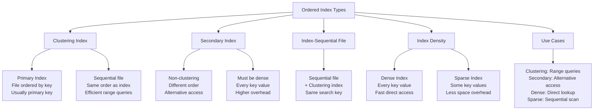
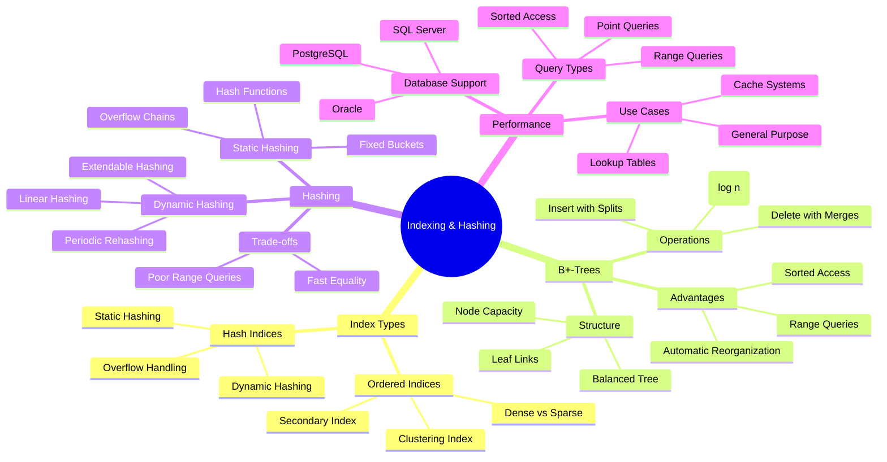

# Indexing and Hashing - Part 2: Complete Notes

## Overview
**Source**: Database System Concepts, 7th Ed. by Silberschatz, Korth, and Sudarshan  
**Topic Coverage**: Index structures, B+-Trees, B-Trees, and hashing techniques for efficient data access

## Table of Contents
1. Basic Index Concepts
2. Ordered Indices
3. B+-Tree Index Files
4. B-Tree Index Files
5. Hashing Techniques
6. Multiple-Key Access
7. Index Creation and Management

## 1. Basic Index Concepts

### Purpose of Indexing
- **Speed up access** to desired data (similar to library catalog system)
- **Search Key**: Attribute or set of attributes used to look up records
- **Index File**: Contains index entries of form `search-key → pointer`

```mermaid
graph TD
    A[Indexing Purpose] --> B[Speed up data access]
    A --> C[Organize data efficiently]
    A --> D[Support different query types]
    
    E[Index Components] --> F[Search Key<br/>Lookup attribute(s)]
    E --> G[Index File<br/>Key → Pointer mapping]
    E --> H[Data File<br/>Actual records]
    
    I[Index Types] --> J[Ordered Indices<br/>Sorted keys]
    I --> K[Hash Indices<br/>Hash function distribution]
    
    L[Performance Metrics] --> M[Access Time<br/>I/O operations]
    L --> N[Insertion Time<br/>Update overhead]
    L --> O[Space Overhead<br/>Storage cost]
    
    P[Query Support] --> Q[Point Queries<br/>Exact matches]
    P --> R[Range Queries<br/>Value ranges]
    P --> S[Sorted Access<br/>Ordered traversal]
    
    A --> E
    A --> I
    A --> L
    A --> P
```

**Indexing Fundamentals:**
- **Purpose**: Accelerate data access through organized structures
- **Components**: Search keys, index files, and data files
- **Types**: Ordered (sorted) vs Hash (distributed)
- **Trade-offs**: Speed vs space vs maintenance overhead

### Index Types
- **Ordered Indices**: Search keys stored in sorted order
- **Hash Indices**: Search keys distributed using hash function

### Evaluation Metrics
- **Access Types Supported**:
  - Records with specified attribute value
  - Records within specified value range
- **Performance Measures**:
  - Access time (I/O operations)
  - Insertion time
  - Deletion time
  - Space overhead

## 2. Ordered Indices

### Classification of Ordered Indices

#### Clustering Index (Primary Index)
- Search key specifies sequential order of file
- Usually but not necessarily the primary key
- File is sequentially ordered on the search key

#### Secondary Index (Non-clustering Index)
- Search key specifies order different from file's sequential order
- Provides alternative access paths

#### Index-Sequential File
- Sequential file ordered on search key
- With clustering index on the same search key



**Ordered Index Classification:**
- **Clustering**: File ordered by index key, efficient for range queries
- **Secondary**: Alternative access path, must be dense
- **Density**: Dense (every key) vs Sparse (some keys)

### Dense Index Files
- **Index record for every search-key value** in the file
- **Example**: Index on ID attribute of instructor relation
- **Advantage**: Fast direct access to any search key value
- **Disadvantage**: Higher space overhead

### Sparse Index Files
- **Index records for only some search-key values**
- Applicable when records are sequentially ordered
- **Search Process**:
  1. Find index record with largest search-key value < K
  2. Search file sequentially starting from that record

#### Sparse vs. Dense Trade-offs
- **Sparse Advantages**:
  - Less space
  - Less maintenance overhead for insertions/deletions
- **Sparse Disadvantages**:
  - Generally slower for record location
- **Optimal Strategy**:
  - Clustered index: Sparse with entry for every block
  - Unclustered index: Sparse on top of dense (multilevel)

### Secondary Indices
- **Must be dense** (unlike primary indices)
- Index record points to bucket containing pointers to all records with that search-key value
- **Example**: Secondary index on salary field

### Multilevel Index
- **Problem**: Large indices may not fit in memory
- **Solution**: Treat index as sequential file and build sparse index on it
- **Levels**:
  - **Outer index**: Sparse index of basic index
  - **Inner index**: The basic index file
- **Updates**: All levels must be updated on insertions/deletions

### Composite Search Keys
- **Multiple attributes** in search key
- **Lexicographic ordering**: 
  - (a₁, a₂) < (b₁, b₂) if either:
    - a₁ < b₁, or
    - a₁ = b₁ and a₂ < b₂
- **Query flexibility**: Can query on prefix of composite key

## 3. B+-Tree Index Files

### Advantages over Indexed-Sequential Files
- **Automatic reorganization** with small, local changes
- **No periodic reorganization** required
- **Handles insertions/deletions** efficiently
- **Minor disadvantages**: Extra overhead for operations, space overhead

### B+-Tree Properties
- **Rooted tree** with all root-to-leaf paths same length
- **Node capacity**: Between ⌈n/2⌉ and n children for non-root, non-leaf nodes
- **Leaf nodes**: Between ⌈(n-1)/2⌉ and n-1 values
- **Root special cases**:
  - Non-leaf: At least 2 children
  - Leaf: 0 to (n-1) values

```mermaid
graph TD
    A[B+-Tree Structure] --> B[Balanced Tree]
    A --> C[All paths same length]
    A --> D[Node capacity rules]
    
    E[Node Types] --> F[Root Node<br/>Special rules]
    E --> G[Internal Nodes<br/>⌈n/2⌉ to n children]
    E --> H[Leaf Nodes<br/>⌈(n-1)/2⌉ to n-1 values]
    
    I[Node Structure] --> J[P₁ | K₁ | P₂ | K₂ | ... | Pₙ₋₁ | Kₙ₋₁ | Pₙ]
    I --> K[Kᵢ: Search keys<br/>Pᵢ: Pointers]
    
    L[Leaf Properties] --> M[Pᵢ points to records<br/>Pₙ points to next leaf<br/>Keys in sorted order]
    
    N[Internal Properties] --> O[P₁: keys < K₁<br/>Pᵢ: Kᵢ₋₁ ≤ keys < Kᵢ<br/>Pₙ: keys ≥ Kₙ₋₁]
    
    P[Advantages] --> Q[Automatic reorganization<br/>No periodic rebuild<br/>Efficient operations<br/>O(log n) complexity]
    
    A --> E
    A --> I
    A --> L
    A --> N
    A --> P
```

**B+-Tree Key Properties:**
- **Balanced**: All leaf nodes at same level
- **Node Capacity**: Enforced minimum and maximum
- **Leaf Links**: Connected for range queries
- **Efficient**: O(log n) search, insert, delete

### B+-Tree Node Structure
```
[P₁ | K₁ | P₂ | K₂ | ... | Pₙ₋₁ | Kₙ₋₁ | Pₙ]
```
- **Kᵢ**: Search-key values (ordered: K₁ < K₂ < ... < Kₙ₋₁)
- **Pᵢ**: Pointers to children (non-leaf) or records/buckets (leaf)

### Leaf Node Properties
- **Pᵢ** (i=1 to n-1): Points to file record with search-key value Kᵢ
- **Pₙ**: Points to next leaf node in search-key order
- **Ordering**: Lᵢ's keys ≤ Lⱼ's keys if i < j

### Non-Leaf Node Properties
- Form **multi-level sparse index** on leaf nodes
- **Pointer semantics**:
  - P₁: All keys < K₁
  - Pᵢ (2≤i≤n-1): Keys ≥ Kᵢ₋₁ and < Kᵢ
  - Pₙ: All keys ≥ Kₙ₋₁

### B+-Tree Characteristics
- **Logical closeness** ≠ physical closeness (pointer-based)
- **Small height**: log⌈n/2⌉(K) for K search-key values
- **Efficient operations**: O(log n) time for search, insert, delete
- **Typical parameters**:
  - Node size = disk block (4KB)
  - n ≈ 100 (40 bytes per index entry)
  - 1 million keys → height ≤ 4

### Query Processing

#### Point Queries
```
function find(v):
    C = root
    while C is not leaf:
        Find least i such that v ≤ Kᵢ
        if no such i: C = last non-null pointer
        else if v = Kᵢ: C = Pᵢ₊₁
        else: C = Pᵢ
    if Kᵢ = v for some i: return Pᵢ
    else: return null
```

#### Range Queries
- Find all records with search-key values in given range
- **Iterator interface**: Fetch matching records one at a time using next function

### Update Operations

#### Insertion
1. Find leaf node where key should appear
2. If room: insert (key, pointer) pair
3. If full: split node and propagate update

**Splitting Process**:
- Take n entries in sorted order (including new)
- Place first ⌈n/2⌉ in original node, rest in new node
- Insert (k, p) in parent (k = least key in new node)
- Propagate splits upward if necessary

#### Deletion
1. Remove (key, pointer) from leaf node
2. Handle underflow:
   - **Merge**: If node + sibling fit in one node
   - **Redistribute**: Otherwise, redistribute pointers
3. Propagate changes upward

```mermaid
graph TD
    A[B+-Tree Updates] --> B[Insertion Process]
    A --> C[Deletion Process]
    
    B --> D[1. Find leaf node]
    B --> E[2. Insert if room]
    B --> F[3. Split if full]
    
    F --> G[Split Process<br/>Take n entries<br/>Split at ⌈n/2⌉<br/>Propagate to parent]
    
    C --> H[1. Remove from leaf]
    C --> I[2. Handle underflow]
    C --> J[3. Propagate changes]
    
    I --> K[Merge<br/>Node + sibling<br/>fit in one node]
    I --> L[Redistribute<br/>Borrow from sibling<br/>Maintain capacity]
    
    M[Split Example] --> N[Original: [10,20,30,40,50]<br/>New: [10,20,30] + [40,50]<br/>Parent gets key 40]
    
    O[Deletion Cases] --> P[Simple removal<br/>No underflow]
    O --> Q[Merge with sibling<br/>Redistribute pointers<br/>Root deletion]
    
    A --> M
    A --> O
```

**B+-Tree Update Operations:**
- **Insertion**: Find leaf, insert or split, propagate upward
- **Deletion**: Remove from leaf, handle underflow, propagate changes
- **Splitting**: Divide full nodes, maintain balance
- **Merging**: Combine underflow nodes with siblings

**Deletion Cases**:
- **Simple removal**: No underflow
- **Merging**: Combine with sibling
- **Redistribution**: Borrow from sibling
- **Root deletion**: If root has only one child after deletion

### Complexity Analysis
- **Worst-case**: O(log⌈n/2⌉(K)) I/O operations
- **Practice**: Fewer I/O operations due to:
  - Internal nodes in buffer
  - Rare splits/merges
- **Space utilization**: 2/3 full on average with random inserts

### Handling Non-Unique Keys
- **Composite key**: (aᵢ, Aₚ) where Aₚ guarantees uniqueness
- **Range search**: (v, -∞) to (v, +∞) for aᵢ = v
- **I/O considerations**:
  - Clustering index: Sequential access
  - Non-clustering: Potential random access per record

### B+-Tree File Organization
- **Leaf nodes store records** instead of pointers
- **Maintains data clustering** through updates
- **Space utilization critical** (records larger than pointers)
- **Improved redistribution**: Involve multiple siblings to avoid splits/merges

## 4. B-Tree Index Files

### Differences from B+-Trees
- **Search keys appear only once** (no redundant storage)
- **Non-leaf nodes** include additional pointer fields
- **Generalized structure**:
  ```
  [P₁ | B₁ | K₁ | P₂ | B₂ | K₂ | ... | Pₘ₋₁ | Bₘ₋₁ | Kₘ₋₁ | Pₘ]
  ```
  Where Bᵢ are bucket or file record pointers

### Advantages
- **Fewer tree nodes** than equivalent B+-tree
- **Possible early termination** of search

### Disadvantages
- **Small fraction** of searches find key early
- **Reduced fan-out** (larger non-leaf nodes)
- **Greater depth** than B+-trees
- **More complex** insertion/deletion
- **Harder implementation**

### Practical Considerations
- **Advantages rarely outweigh disadvantages**
- **B+-trees preferred** in most database systems

## 5. Hashing Techniques

### Static Hashing
- **Hash function**: h: K → B (fixed set of bucket addresses)
- **Bucket**: Storage unit (typically disk block)
- **Hash index**: Buckets store entries with record pointers
- **Hash file organization**: Buckets store records directly

```mermaid
graph TD
    A[Hashing Techniques] --> B[Static Hashing]
    A --> C[Dynamic Hashing]
    
    B --> D[Fixed hash function<br/>Fixed bucket count<br/>h: K → B]
    B --> E[Hash Index<br/>Buckets store pointers<br/>to records]
    B --> F[Hash File Organization<br/>Buckets store records<br/>directly]
    
    C --> G[Periodic Rehashing<br/>Create larger table<br/>Rehash all entries]
    C --> H[Linear Hashing<br/>Incremental rehashing<br/>Add buckets gradually]
    C --> I[Extendable Hashing<br/>Disk-optimized<br/>Shared buckets]
    
    J[Hash Function Example] --> K[h(ID) = (sum of digits) % 8<br/>ID 10101 → (1+0+1+0+1) % 8 = 3]
    
    L[Overflow Handling] --> M[Closed Addressing<br/>Chain overflow buckets<br/>Linked list structure]
    
    N[Strengths] --> O[Fast equality searches<br/>O(1) average case<br/>Simple implementation]
    
    P[Limitations] --> Q[Poor range queries<br/>No sorted access<br/>Fixed bucket count]
    
    A --> J
    A --> L
    A --> N
    A --> P
```

**Hashing Fundamentals:**
- **Static**: Fixed hash function and bucket count
- **Dynamic**: Adapts to data size changes
- **Strengths**: Fast equality searches, simple implementation
- **Limitations**: Poor range queries, no sorted access

#### Hash Function Example
- h(ID) = (sum of all digits in ID) % 8
- **Bucket calculation**: For ID 10101 → (1+0+1+0+1) % 8 = 3

#### Strengths and Limitations
- **Good for**: Random point queries (equality searches)
- **Poor for**: Range queries, sorted access

### Bucket Overflow Handling
- **Causes**:
  - Insufficient buckets
  - Skewed distribution
    - Multiple records with same key
    - Non-uniform hash function
- **Solution**: Overflow chaining (closed addressing)
  - Chain overflow buckets in linked list

### Deficiencies of Static Hashing
- **Fixed number of buckets** doesn't adapt to data size changes
- **Solutions**:
  - Too small: Performance degradation
  - Too large: Space wastage
  - Periodic reorganization: Expensive and disruptive

### Dynamic Hashing Techniques
- **Periodic rehashing**: Create larger table and rehash all entries
- **Linear hashing**: Incremental rehashing
- **Extendable hashing**: Tailored for disk, buckets shared by multiple hash values

### Comparison: Indexing vs. Hashing
- **Hashing better for**: Equality searches, point queries
- **Ordered indices better for**: Range queries, sorted access
- **Database support**:
  - PostgreSQL: Hash indices (discouraged)
  - Oracle: Static hash organization only
  - SQL Server: B+-trees only

```mermaid
graph TD
    A[Indexing vs Hashing] --> B[B+-Trees]
    A --> C[Hash Tables]
    
    B --> D[Ordered indices<br/>Balanced trees<br/>Range queries]
    B --> E[O(log n) complexity<br/>Sorted access<br/>Range searches]
    
    C --> F[Hash functions<br/>Bucket distribution<br/>Equality searches]
    C --> G[O(1) average case<br/>No ordering<br/>Point queries only]
    
    H[Query Type Support] --> I[Equality: Hash > B+-Tree<br/>Range: B+-Tree > Hash<br/>Sorted: B+-Tree only]
    
    J[Database Support] --> K[PostgreSQL: B+-Tree primary<br/>Oracle: Both supported<br/>SQL Server: B+-Tree only]
    
    L[Performance Trade-offs] --> M[Hash: Fast equality<br/>B+-Tree: Balanced performance<br/>Hash: Poor range queries<br/>B+-Tree: Good for all queries]
    
    N[Use Cases] --> O[Hash: Lookup tables<br/>B+-Tree: General purpose<br/>Hash: Cache systems<br/>B+-Tree: Database indices]
    
    A --> H
    A --> J
    A --> L
    A --> N
```

**Indexing vs Hashing Comparison:**
- **B+-Trees**: Balanced performance, good for all query types
- **Hash Tables**: Excellent for equality, poor for ranges
- **Database Support**: Varies by system, B+-trees more common
- **Use Cases**: Choose based on query patterns

## 6. Multiple-Key Access

### Query Strategies
**Example**: `WHERE dept_name = "Finance" AND salary = 80000`

1. **Use dept_name index**, then test salary
2. **Use salary index**, then test dept_name  
3. **Intersection**: Use both indices, take pointer intersection

### Composite Search Keys
- **Efficient for**: Multiple attribute conditions
- **Handles well**:
  - dept_name = "Finance" AND salary = 80000
  - dept_name = "Finance" AND salary < 80000
- **Handles poorly**:
  - dept_name < "Finance" AND salary = 80000

### Covering Indices
- **Extra attributes** in index to avoid record fetching
- **Store only at leaf** (save space in non-leaf nodes)
- **Particularly useful** for secondary indices

## 7. Index Creation and Management

### SQL Index Definition
```sql
-- Create index
CREATE INDEX <index-name> ON <relation-name> (<attribute-list>);

-- Create unique index  
CREATE UNIQUE INDEX <index-name> ON <relation-name> (<attribute-list>);

-- Drop index
DROP INDEX <index-name>;
```

### Automatic Index Creation
- **Primary keys**: Automatically indexed by all databases
- **Foreign keys**: Sometimes automatically indexed
  - Useful for joins: `takes ⋈ student` with `name = 'Shankar'`

### Index Tuning Considerations
- **Trade-off**: Faster lookups vs. update overhead
- **Index tuning assistants**: Help choose indices based on workload
- **Factors to consider**:
  - Query patterns
  - Update frequency
  - Data distribution
  - Storage constraints

## Key Takeaways

1. **Indexing Purpose**: Speed up data access through organized structures
2. **B+-Trees Dominance**: Most widely used due to balanced performance
3. **Hashing Specialization**: Excellent for point queries, poor for ranges
4. **Composite Keys**: Enable efficient multi-attribute searches
5. **Update Considerations**: Balance query speed with maintenance overhead
6. **Practical Deployment**: Choose index type based on actual query patterns
7. **Database Variations**: Support varies across different DBMS platforms



**Indexing & Hashing Learning Path:**
- **Fundamentals**: Understand index types and purposes
- **B+-Trees**: Master the most common indexing structure
- **Hashing**: Learn specialized techniques for equality searches
- **Performance**: Balance query speed with maintenance overhead
- **Deployment**: Choose appropriate techniques for your use case

This comprehensive coverage ensures understanding of how different indexing and hashing techniques provide efficient data access patterns for various database workloads and query types.